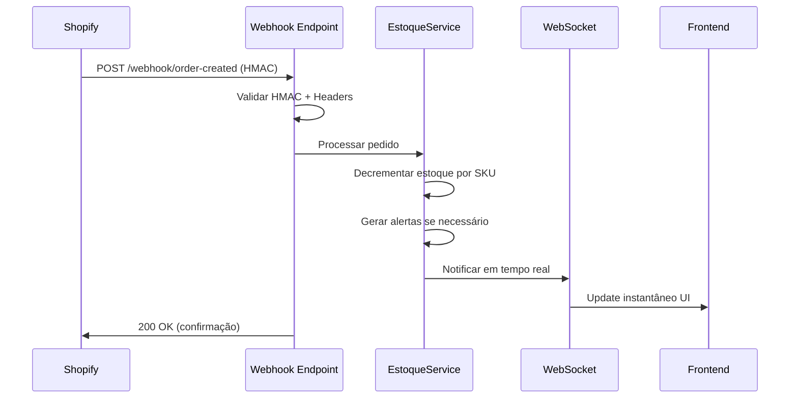

# Sincronização em Tempo Real - ChegouHub

Sistema completo para sincronização automática entre vendas da Shopify e controle de estoque com notificações em tempo real via WebSockets.

## 🚀 Funcionalidades

### ✅ **Webhooks Shopify Automatizados**
- Configuração automática de webhooks em todas as lojas
- Validação HMAC obrigatória para segurança
- Suporte a múltiplos eventos: `orders/paid`, `orders/cancelled`, `orders/refunded`
- Rate limiting e proteção contra ataques

### ✅ **Sincronização de Estoque**
- Decremento automático quando pedido é pago
- Mapeamento por SKU entre Shopify e ChegouHub
- Sistema de alertas inteligente (estoque baixo/zerado)
- Logs detalhados para auditoria

### ✅ **Notificações em Tempo Real**
- WebSockets para updates instantâneos
- Notificações por usuário e por loja
- Alertas críticos priorizados
- Fallback para polling se WebSockets indisponíveis

### ✅ **Gerenciamento Automático**
- API completa para configuração
- Management commands para automação
- Testes de conectividade integrados
- Limpeza de webhooks antigos

---

## 📋 Configuração Inicial

### 1. Instalar Dependências
```bash
# Já incluído em requirements.txt
pip install channels>=4.1.0 channels-redis>=4.2.0
```

### 2. Configurar Redis (Recomendado)
```bash
# Para WebSockets em produção
export REDIS_URL="redis://localhost:6379/0"
```

### 3. Executar Migrações
```bash
python manage.py migrate
```

---

## 🔧 Uso via API

### Configurar Webhooks Automaticamente

**Todas as lojas do usuário:**
```bash
POST /api/sync-realtime/configure-webhooks/
{
  "base_domain": "https://api.chegouhub.com"
}
```

**Loja específica:**
```bash
POST /api/sync-realtime/configure-webhook-single/
{
  "loja_id": 123,
  "base_domain": "https://api.chegouhub.com"
}
```

### Verificar Status dos Webhooks
```bash
GET /api/sync-realtime/webhooks-status/
```

### Testar Conectividade
```bash
GET /api/sync-realtime/test-connectivity/?loja_id=123
```

### Limpar Webhooks Antigos
```bash
DELETE /api/sync-realtime/cleanup-webhooks/
{
  "base_domain": "https://old-api.chegouhub.com"
}
```

---

## 🖥️ Uso via Management Commands

### Configuração Completa
```bash
# Configurar todas as lojas
python manage.py configure_webhooks

# Usuário específico
python manage.py configure_webhooks --user admin

# Loja específica  
python manage.py configure_webhooks --loja-id 123

# URL customizada
python manage.py configure_webhooks --webhook-url https://api.chegouhub.com

# Apenas teste (sem criar webhooks)
python manage.py configure_webhooks --test-only

# Limpar webhooks antigos antes
python manage.py configure_webhooks --cleanup

# Forçar reconfiguração
python manage.py configure_webhooks --force
```

---

## 🔌 WebSockets para Frontend

### Conectar ao Sistema de Estoque
```javascript
// URL do WebSocket  
const wsUrl = `ws://localhost:8000/ws/estoque/?loja_id=123&session_key=${sessionKey}`;
const socket = new WebSocket(wsUrl);

// Eventos recebidos
socket.onmessage = function(event) {
    const data = JSON.parse(event.data);
    
    switch(data.type) {
        case 'venda_shopify_processada':
            // Nova venda foi processada
            console.log('Venda processada:', data.data);
            break;
            
        case 'estoque_atualizado':
            // Estoque de produto foi alterado
            console.log('Estoque atualizado:', data.data);
            break;
            
        case 'produto_estoque_zero':
            // CRÍTICO: Produto zerou estoque
            console.log('ALERTA CRÍTICO:', data.data);
            break;
            
        case 'alerta_estoque_gerado':
            // Novo alerta de estoque baixo
            console.log('Novo alerta:', data.data);
            break;
    }
};

// Manter conexão viva
setInterval(() => {
    if (socket.readyState === WebSocket.OPEN) {
        socket.send(JSON.stringify({type: 'ping'}));
    }
}, 30000);
```

### Conectar a Notificações Gerais
```javascript
const notificationSocket = new WebSocket(
    `ws://localhost:8000/ws/notifications/?session_key=${sessionKey}`
);

notificationSocket.onmessage = function(event) {
    const data = JSON.parse(event.data);
    
    switch(data.type) {
        case 'system_notification':
            showSystemMessage(data.data.message, data.data.priority);
            break;
            
        case 'webhook_status_change':
            updateWebhookStatus(data.data);
            break;
    }
};
```

---

## 🔐 Segurança Implementada

### Validação de Webhooks
- ✅ **HMAC SHA256** obrigatório para todos os webhooks
- ✅ **Rate limiting** por IP (60 req/min)
- ✅ **Headers Shopify** validados
- ✅ **Domínios permitidos** apenas .myshopify.com
- ✅ **Logs sanitizados** (sem dados sensíveis)

### Autenticação WebSocket  
- ✅ **Session-based** authentication
- ✅ **Grupos por usuário** isolados
- ✅ **Validação de acesso** a lojas
- ✅ **Timeout automático** para conexões inativas

---

## 📊 Monitoramento

### Status Geral do Sistema
```bash
GET /api/sync-realtime/status/
```
```json
{
  "websockets_available": true,
  "features": {
    "stock_notifications": true,
    "shopify_webhook_processing": true,
    "real_time_alerts": true,
    "bulk_webhook_configuration": true
  },
  "endpoints": {
    "websocket_stock": "/ws/estoque/",
    "websocket_notifications": "/ws/notifications/",
    "webhook_configure": "/api/sync-realtime/configure-webhooks/",
    "webhook_status": "/api/sync-realtime/webhooks-status/"
  }
}
```

### Logs do Sistema
```bash
# Logs de estoque
tail -f backend/logs/estoque.log

# Logs de webhooks
tail -f backend/logs/webhook.log  

# Logs de WebSocket
tail -f backend/logs/channels.log
```

---

## 🔄 Fluxo Completo de Sincronização



---

## 🐛 Troubleshooting

### WebSockets não funcionam
```bash
# Verificar Redis
redis-cli ping

# Verificar Channel Layer
python manage.py shell
>>> from channels.layers import get_channel_layer
>>> channel_layer = get_channel_layer()
>>> print(channel_layer)
```

### Webhooks não chegam
```bash
# Testar conectividade
python manage.py configure_webhooks --test-only

# Verificar logs
tail -f backend/logs/webhook.log

# Verificar no Shopify Admin
# Settings > Notifications > Webhooks
```

### Estoque não atualiza
```bash
# Verificar mapeamento SKU
GET /api/estoque/produtos/?search=SKU123

# Verificar logs de processamento  
GET /api/estoque/webhook/stats/?days=1
```

---

## 🚀 Deploy em Produção

### Railway/Heroku
```bash
# Variáveis de ambiente necessárias
REDIS_URL=redis://...
WEBHOOK_BASE_DOMAIN=https://api.chegouhub.com
DJANGO_SECRET_KEY=...

# Executar após deploy
python manage.py configure_webhooks
```

### Docker
```dockerfile
# Instalar dependências adicionais
RUN pip install channels channels-redis

# Expor porta WebSocket (se diferente do HTTP)
EXPOSE 8000

# Comando de inicialização com suporte ASGI
CMD ["daphne", "-b", "0.0.0.0", "-p", "8000", "config.asgi:application"]
```

---

## 📈 Performance

### Otimizações Implementadas
- ✅ **Connection pooling** Redis
- ✅ **Channel groups** eficientes  
- ✅ **Throttling** por endpoint
- ✅ **Queries otimizadas** com select_related
- ✅ **Índices de banco** apropriados

### Limites Recomendados
- **WebSocket connections**: 1000 simultâneas
- **Webhook rate limit**: 60/min por IP
- **Channel message TTL**: 60 segundos
- **Group membership TTL**: 24 horas

---

## 🔮 Próximas Features

- [ ] Dashboard em tempo real para administradores
- [ ] Notificações push para mobile
- [ ] Integração com Slack/Discord
- [ ] Métricas avançadas (Grafana)
- [ ] Retry automático para webhooks falhados
- [ ] Suporte a múltiplas moedas

---

**Desenvolvido com ❤️ para ChegouHub**