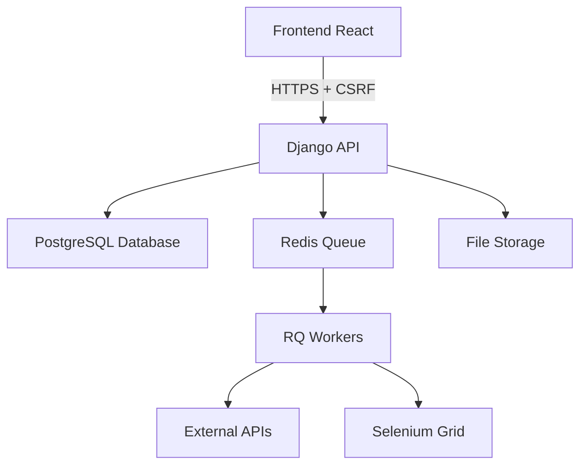

# 🏗️ Arquitetura Geral - Chegou Hub

## O que é o Chegou Hub

O Chegou Hub é uma plataforma completa de gestão empresarial que centraliza calendários, métricas, automações de IA e muito mais. É uma aplicação web full-stack desenvolvida para otimizar o trabalho em equipe e automatizar processos.

## Como funciona

O sistema é organizado como um **monorepo** com arquitetura baseada em features, onde cada funcionalidade é um módulo independente que pode ser desenvolvido e mantido separadamente.

### Arquitetura Técnica

```
📁 chegou-hub/
├── 🔧 backend/          # Django REST API
│   ├── config/          # Configurações Django
│   ├── core/            # Funcionalidades base
│   └── features/        # Cada funcionalidade como app separada
│       ├── agenda/
│       ├── engajamento/
│       ├── ia/
│       ├── mapa/
│       ├── metricas_*/
│       └── [outras features]
├── 🎨 frontend/         # React + shadcn/ui
│   ├── src/
│   │   ├── components/  # Componentes compartilhados
│   │   ├── features/    # Componentes de cada funcionalidade
│   │   ├── pages/       # Páginas principais
│   │   └── hooks/       # React hooks customizados
└── 📚 docs/             # Documentação técnica
```

## Stack Tecnológico

### Backend (Django REST Framework)
- **Framework**: Django 5.2 com Django REST Framework
- **Banco de Dados**: PostgreSQL (produção) / SQLite (desenvolvimento)
- **Autenticação**: Sistema de sessões Django com proteção CSRF
- **Fila de Tarefas**: Django-RQ com Redis para processamento assíncrono
- **Deploy**: Railway com Gunicorn + WhiteNoise

### Frontend (React)
- **Framework**: React 19.1 com React Router DOM
- **Interface**: shadcn/ui + Tailwind CSS
- **Estado**: React Context API e hooks nativos
- **HTTP**: Axios com gerenciamento automático de CSRF tokens

### Integrações Externas
- **OpenAI & Anthropic**: Funcionalidades de IA
- **Google Calendar API**: Integração de calendários
- **Selenium Grid**: Web scraping para métricas
- **APIs Externas**: PRIMECOD, ECOMHUB, DROPI MX

## Princípios Arquiteturais

### 1. **Separação por Features**
Cada funcionalidade é uma app Django independente com:
- Models próprios
- Endpoints de API
- Componentes React específicos
- Documentação separada

### 2. **API-First**
- Frontend e backend completamente separados
- Comunicação 100% via REST API
- Documentação automática de endpoints

### 3. **Segurança Robusta**
- Autenticação baseada em sessões
- Proteção CSRF em todas as requisições
- CORS configurado para domínios específicos
- Variáveis sensíveis externalizadas

### 4. **Processamento Assíncrono**
- Tarefas pesadas executadas em background via RQ
- Sistema de logs centralizado
- Monitoramento de workers

## Fluxo de Dados



### Autenticação e Autorização

1. **Login**: Usuário faz login via endpoint `/login/`
2. **Sessão**: Django cria sessão persistente com cookie seguro
3. **CSRF**: Cada requisição inclui token CSRF
4. **Autorização**: Endpoints verificam permissões automaticamente

### Processamento de Background

1. **Enfileiramento**: Tasks são enviadas para Redis via Django-RQ
2. **Processamento**: Workers executam tasks assincronamente
3. **Logging**: Todos os processos são logados para auditoria
4. **Monitoramento**: Status dos workers é monitorado em tempo real

## Estrutura de Diretórios Detalhada

### Backend
```
backend/
├── config/
│   ├── settings.py      # Configurações principais
│   ├── urls.py          # Roteamento principal
│   └── wsgi.py          # Deploy WSGI
├── core/
│   ├── models.py        # Modelos base
│   ├── views.py         # Views compartilhadas
│   └── middleware.py    # Middleware customizado
└── features/
    ├── agenda/          # Sistema de calendários
    ├── engajamento/     # Métricas de engajamento
    ├── ia/              # Dashboard de projetos IA
    ├── mapa/            # Cobertura geográfica
    ├── feedback/        # Sistema de feedback
    ├── novelties/       # Novidades da empresa
    ├── processamento/   # Processamento de dados
    ├── metricas_primecod/  # Métricas PRIMECOD
    ├── metricas_ecomhub/   # Métricas ECOMHUB
    ├── metricas_dropi/     # Métricas DROPI
    └── chatbot_ia/         # Chatbot inteligente
```

### Frontend
```
frontend/src/
├── components/
│   ├── ui/             # Componentes shadcn/ui
│   ├── app-sidebar.jsx # Navegação principal
│   ├── FeedbackButton.jsx
│   └── [outros componentes]
├── features/           # Componentes por feature
│   ├── agenda/
│   ├── engajamento/
│   ├── ia/
│   ├── mapa/
│   ├── metricas/
│   ├── novelties/
│   └── processamento/
├── pages/
│   ├── LoginPage.js    # Página de login
│   └── WorkspacePage.js # Página principal
├── hooks/
│   └── useCSRF.js      # Hook para CSRF tokens
└── utils/
    └── csrf.js         # Utilitários CSRF
```

## Configurações de Ambiente

### Desenvolvimento Local
```bash
# Backend
cd backend
python manage.py runserver

# Frontend  
cd frontend
npm start

# Workers (opcional)
cd backend
python manage.py rqworker
```

### Produção (Railway)
- **Backend**: Deploy automático via Railway
- **Frontend**: Build estático servido pelo Django
- **Workers**: RQ workers executam automaticamente
- **Database**: PostgreSQL gerenciado pelo Railway

## Próximos Passos

Para entender melhor o sistema, consulte:

1. [📋 Configurações Backend](backend/configuracoes.md) - Settings detalhados
2. [🎨 Estrutura Frontend](frontend/estrutura-frontend.md) - Organização React
3. [🔧 Features Backend](backend/features/) - Documentação de cada funcionalidade
4. [📱 Páginas Frontend](frontend/pages/) - Documentação das interfaces
5. [🚀 Deploy](deployment/railway-deploy.md) - Processo de deploy

---

**Essa arquitetura garante escalabilidade, manutenibilidade e separação clara de responsabilidades, permitindo que diferentes desenvolvedores trabalhem em features independentes sem conflitos.**